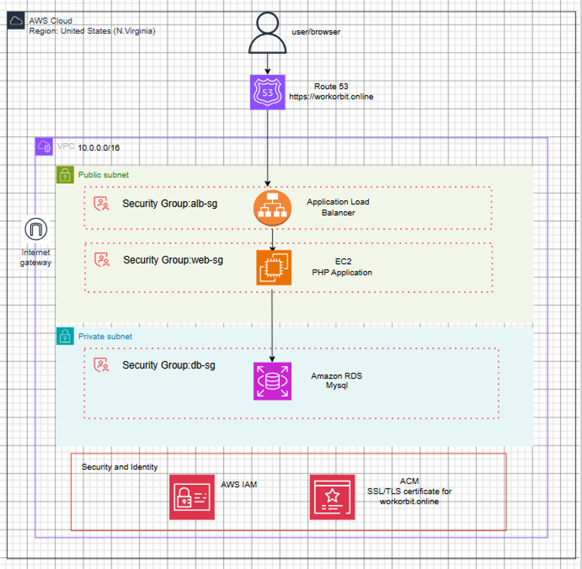
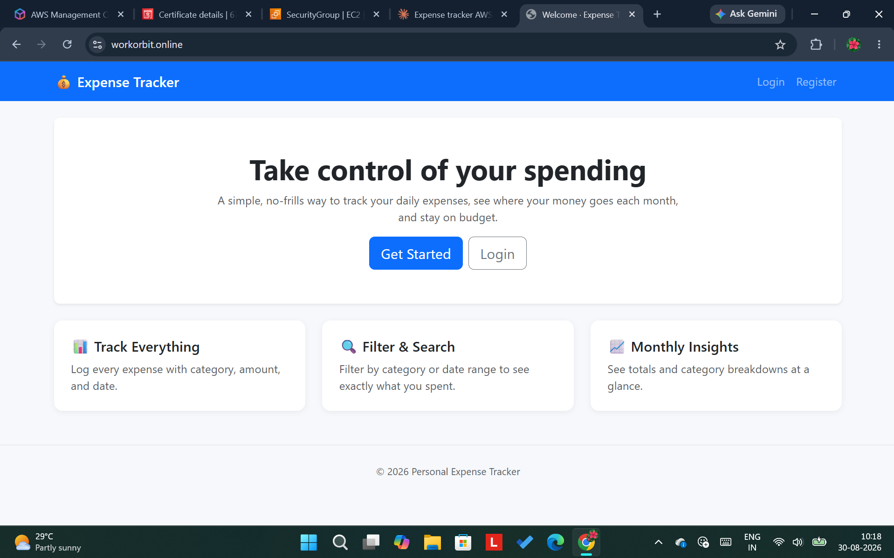
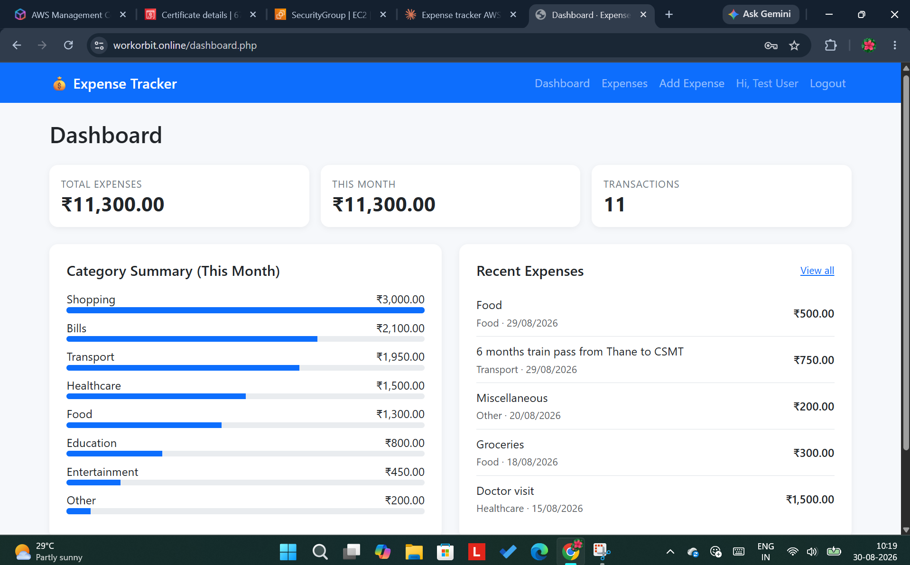
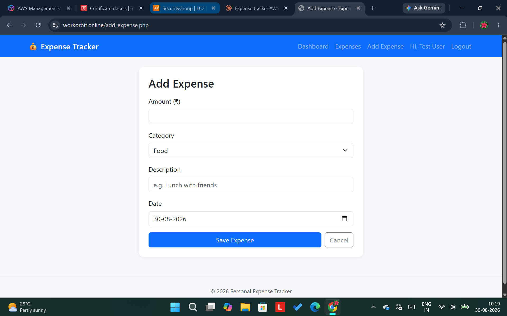
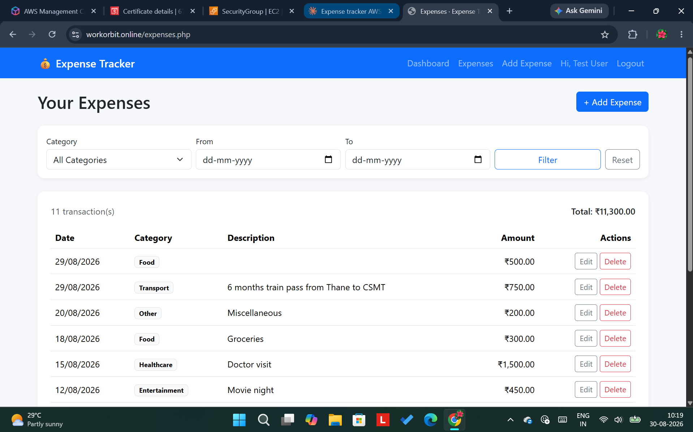
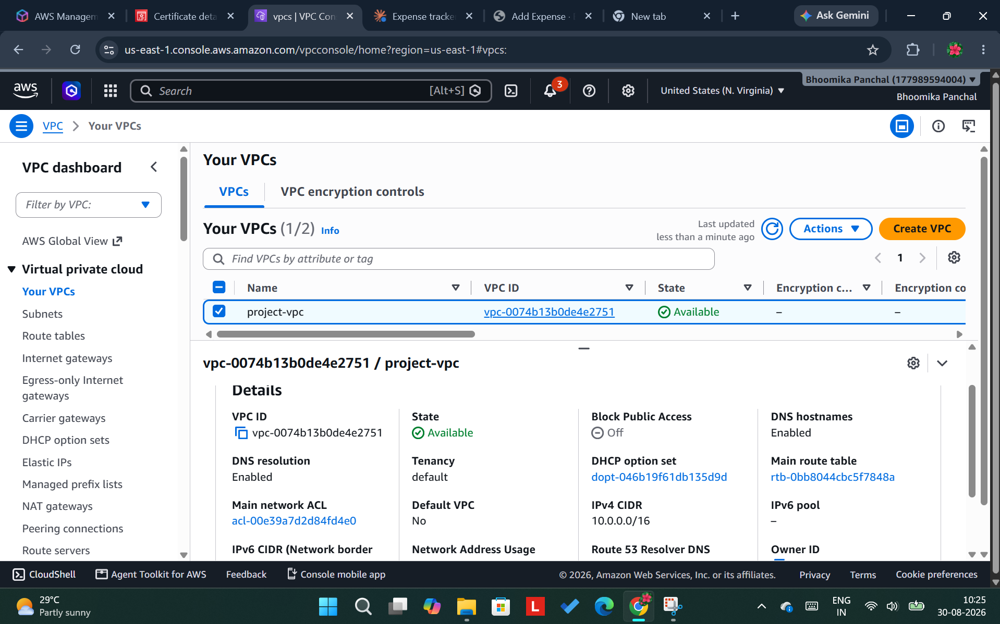
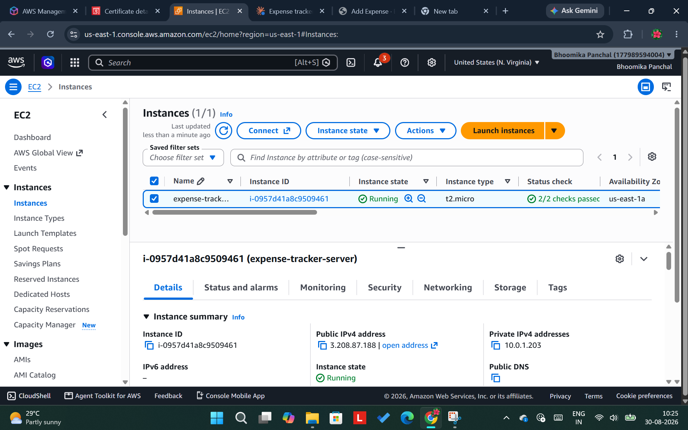
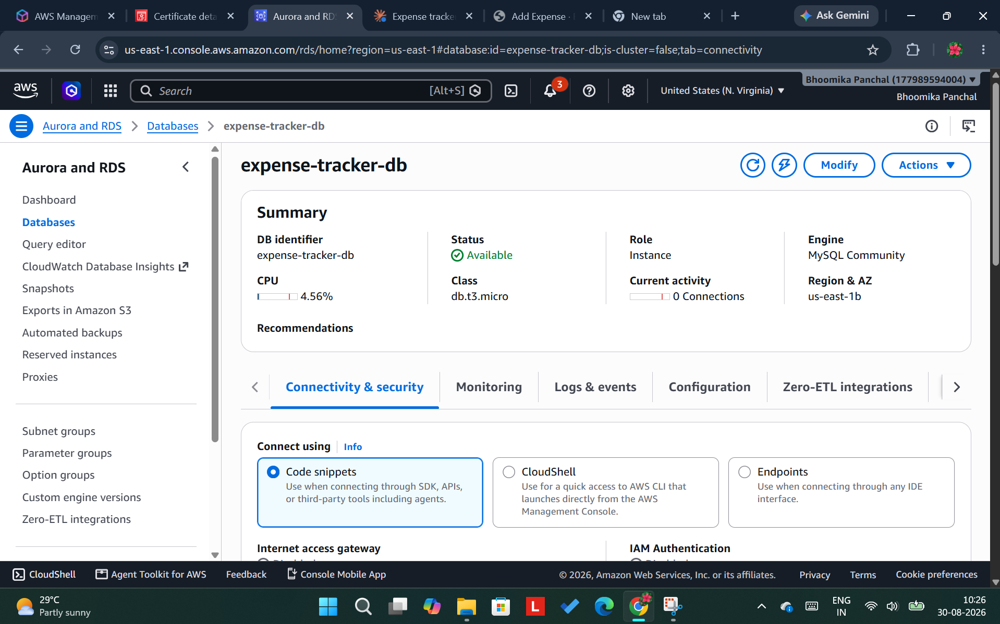
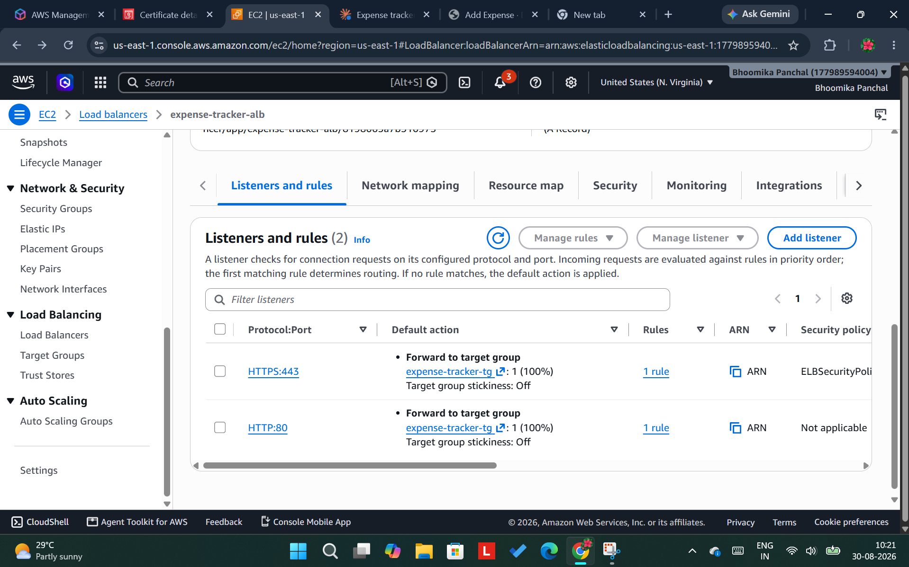
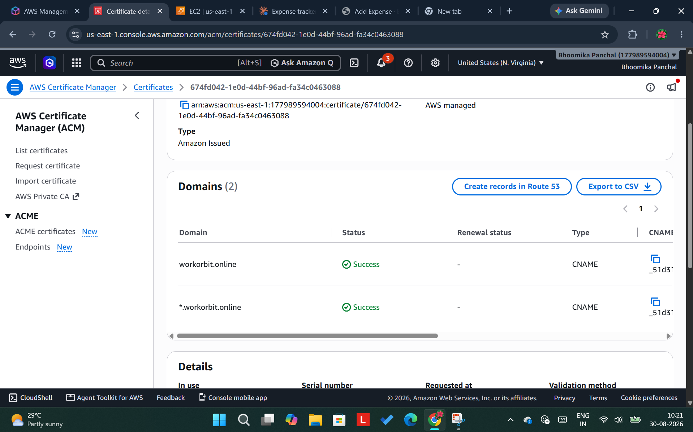

<div align="center">

# ☁️ AWS 3-Tier Cloud Architecture
### Application Load Balancer → EC2 → RDS, deployed with a Personal Expense Tracker as the example app


**Live demo:** [workorbit.online](https://workorbit.online)

</div>

---

## Overview

A production-style **3-tier architecture on AWS** — Application Load Balancer → EC2 → RDS MySQL, inside a custom VPC with public/private subnet isolation and security-group-enforced trust boundaries. The application layer (a simple PHP/MySQL Personal Expense Tracker) was deliberately kept small so the real focus could stay on the infrastructure: networking, security, IAM, and deployment — built as a learning project.

The app itself isn't the point — the architecture is. Users, expenses, and CRUD operations are just the workload running on top of it.
EOF

## Table of contents

- [Architecture](#architecture)
- [Tech stack](#tech-stack)
- [Features](#features)
- [Screenshots](#screenshots)
- [AWS infrastructure, piece by piece](#aws-infrastructure-piece-by-piece)
- [Security](#security)
- [Local setup](#local-setup-xampp)
- [AWS deployment (high level)](#aws-deployment-high-level)
- [What I'd add next](#what-id-add-next)
- [Project structure](#project-structure)

## Architecture



```
Internet
   │
   ▼
Internet Gateway
   │
   ▼
Application Load Balancer   (public subnets · alb-sg: HTTP from anywhere)
   │
   ▼
EC2 — Apache + PHP           (public subnet · web-sg: HTTP only from alb-sg)
   │
   ▼
RDS — MySQL                  (private subnets · db-sg: MySQL only from web-sg)
```

The browser can only ever reach the load balancer. The load balancer is the only thing `web-sg` trusts, and EC2 is the only thing `db-sg` trusts. Even with the database's hostname in hand, there is no network path to it from outside the VPC — the private subnets simply have no route to the internet. Security here is enforced at the network layer, not only the application layer.

## Tech stack

| Layer | Technology |
|---|---|
| Frontend | HTML5, CSS3, Bootstrap 5, vanilla JavaScript |
| Backend | PHP 8+ |
| Database | MySQL |
| Web server | Apache |
| Cloud infrastructure | AWS VPC, EC2, RDS, Application Load Balancer, Route 53, ACM, IAM |

Deliberately *not* used: React/Angular/Vue, Node.js, Laravel, Docker, Kubernetes — keeping the application simple enough to fully understand end-to-end kept all the learning effort on the AWS side.

## Features

- User registration, login, and logout via PHP sessions
- Add, edit, and delete expenses — each user only ever sees their own
- Filter expenses by category and/or date range
- Dashboard with total spend, current-month spend, transaction count, and a category breakdown
- Passwords hashed with `password_hash()` / `password_verify()` — never stored in plaintext
- All database queries use PDO prepared statements — no raw string concatenation of user input into SQL
- Every expense read, update, and delete is scoped by `user_id`, so a user can never touch another user's data by changing an `id` in the URL

## Screenshots

| Landing page | Dashboard |
|---|---|
|  |  |

| Add expense | Expenses list |
|---|---|
|  |  |

### AWS Console

| VPC | EC2 |
|---|---|
|  |  |

| RDS | ALB |
|---|---|
|  |  |



## AWS infrastructure, piece by piece

| Component | Purpose |
|---|---|
| **VPC** (`10.0.0.0/16`) | An isolated network boundary for the whole project |
| **Public subnets** (2 AZs) | Host the ALB and EC2 — reachable from the internet via an Internet Gateway |
| **Private subnets** (2 AZs) | Host RDS — no internet route at all |
| **`alb-sg`** | Allows inbound HTTP (80) from anywhere |
| **`web-sg`** | Allows inbound HTTP (80) *only* from `alb-sg`, and SSH (22) from a trusted IP |
| **`db-sg`** | Allows inbound MySQL (3306) *only* from `web-sg` |
| **EC2** | Runs Apache + PHP 8, application code deployed via `git clone` from this repo |
| **RDS (MySQL)** | Managed MySQL instance, schema loaded from `database.sql` |
| **ALB** | Public entry point; forwards HTTP traffic to EC2 via a target group with health checks |
| **Route 53 + ACM** | Custom domain with a free SSL/TLS certificate for HTTPS |
| **IAM** | A scoped admin user for daily console work — the AWS root account is not used day to day |

## Security

- **No public database access, ever.** RDS lives in private subnets with no internet route, regardless of security group rules.
- **Least-privilege network access.** Each security group only trusts the specific tier above it — verified by confirming EC2 is unreachable by its own public IP once the ALB is in front of it.
- **Credentials are never committed.** `config/database.php` is listed in `.gitignore`. An early commit briefly included real RDS credentials during initial development; the RDS master password was rotated immediately afterward, so that historical commit poses no risk.
- **No root account usage.** Console work is done through a scoped IAM user rather than the AWS account's root credentials.
- **SQL injection protection.** All queries use PDO prepared statements — no user input is ever concatenated into a query string.
- **Password hashing.** `password_hash()` / `password_verify()` (bcrypt) — passwords are never stored or logged in plaintext.

## Local setup (XAMPP)

1. Install/start Apache and MySQL in XAMPP.
2. Copy this repo into your XAMPP `htdocs` directory.
3. Import `database.sql` via phpMyAdmin — this creates the database, tables, and a sample test user.
4. Check `config/database.php` — the XAMPP defaults (`localhost`, user `root`, empty password) should work out of the box.
5. Open `http://localhost/expense-tracker/` in your browser.
6. Register an account, or log in with the sample user: `test@example.com` / `Test@1234`.

## AWS deployment (high level)

1. Create a VPC with 2 public + 2 private subnets across 2 Availability Zones, an Internet Gateway, and appropriate route tables.
2. Create `web-sg` and `db-sg`, with `db-sg` sourcing MySQL access from `web-sg` — not an IP range.
3. Launch RDS MySQL in the private subnets, not publicly accessible, secured by `db-sg`.
4. Launch an EC2 instance in a public subnet, secured by `web-sg`; install Apache, PHP, and the MySQL client.
5. Clone this repo onto EC2 into `/var/www/html`, set ownership/permissions for the `apache` user.
6. Update `config/database.php` with the RDS endpoint and credentials.
7. Import `database.sql` into RDS.
8. Create a target group and Application Load Balancer in front of EC2, with its own `alb-sg`.
9. Lock `web-sg` to only accept HTTP from `alb-sg`, so EC2 is no longer reachable by its own public IP.
10. Point a custom domain at the ALB via Route 53, and issue a free SSL certificate via ACM for HTTPS.

## What I'd add next

- Auto Scaling group behind the ALB, instead of a single EC2 instance
- Infrastructure as Code (Terraform or CloudFormation) so this environment is fully reproducible
- AWS Secrets Manager for database credentials, instead of a config file
- CloudWatch alarms and basic monitoring

## Project structure

```
expense-tracker/
├── config/database.php      # DB connection (gitignored — see Security)
├── includes/                 # header, footer, auth, shared functions
├── assets/                   # css, js
├── screenshots/               # app screenshots used in this README
├── index.php, login.php, register.php
├── dashboard.php, expenses.php
├── add_expense.php, edit_expense.php, delete_expense.php
├── logout.php
├── architecture.svg
└── database.sql
```

---

<div align="center">

Built by **Bhoomika Panchal** 

</div>
